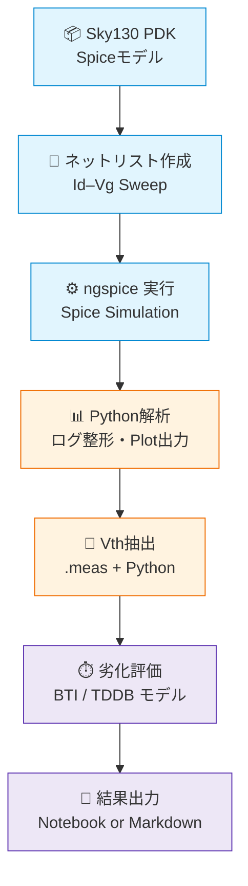

---

# ⚗️ 実践編 第2章：Sky130実験とSPICE特性評価  
**Practical Chapter 2: Sky130 Experiments and SPICE-Based Characterization**

---

## 🔗 公式リンク / *Official Links*

| 言語 / Language | GitHub Pages 🌐 | GitHub 💻 |
|-----------------|----------------|-----------|
| 🇯🇵 日本語 / *Japanese* | [](https://samizo-aitl.github.io/Edusemi-v4x/e_chapter2_sky130_experiments/) | [](https://github.com/Samizo-AITL/Edusemi-v4x/tree/main/e_chapter2_sky130_experiments) |

---

## 📘 概要｜Overview

本章では、SkyWaterの Sky130 PDK を用いて、MOSトランジスタの基本特性（**Vg–Idカーブ・Vth抽出**）や、  
**BTI / TDDB による劣化予測**まで含む、**SPICEベースの設計評価実験**を構成します。  

This chapter utilizes the **Sky130 PDK** to evaluate MOSFET characteristics such as **Vg–Id curves**,  
**threshold voltage (Vth)**, and **reliability predictions** using BTI and TDDB models via **SPICE simulations**.

---

## 🎯 学習目的｜Learning Objectives

- ✅ Sky130 MOS モデルによる SPICE 実験  
 SPICE simulation using Sky130 device models  
- ✅ Python による自動化・可視化・寿命推定  
 Automation, visualization, and lifetime estimation with Python  
- ✅ `.meas` による定量抽出とスクリプト連携  
 Measurement extraction using `.meas` and scripting integration  

---

## 📁 章内構成｜Chapter Contents

| フォルダ｜Folder | 内容｜Description |
|------------------|----------------------------------------------------------|
| [`01_setup_sky130_model/`](01_setup_sky130_model/README.md) | Sky130 と `ngspice` の環境構築｜Set up Sky130 and ngspice |
| [`02_idvg_experiment/`](02_idvg_experiment/README.md) | Vg–Id 特性の Sweep シミュレーション｜Id–Vg parametric sweep |
| [`03_vth_extraction/`](03_vth_extraction/README.md) | `.meas` による Vth 自動抽出｜Automated Vth extraction |
| [`04_bti_tddb_estimation/`](04_bti_tddb_estimation/README.md) | BTI・TDDB による寿命評価モデル｜Reliability prediction |
| [`05_data_summary/`](05_data_summary/README.md) | 全実験結果の要約・図表出力｜Summary and visualization |

---

## 🔧 実行環境｜Required Environment

| 項目｜Item | 内容｜Details |
|--------|----------------------------------------------------|
| Python | 3.9 以上（Recommended: 3.10） |
| 必須ライブラリ | `matplotlib`, `pandas`, `numpy` |
| シミュレータ | `ngspice` version 35+ |
| PDK環境 | `Sky130 PDK`（例：`sky130_fd_pr__nfet_01v8`） |

インストール例：

```bash
pip install matplotlib pandas numpy
```

---

## 🔁 実験フロー｜Experiment Flow

```text
1. Sky130 PDK の .spice モデルを用意
2. Vg–Id Sweep 用 SPICEネットリストを作成
3. Python でログファイルを解析・可視化
4. `.meas` により Vth 抽出処理を自動化
5. BTI・TDDB に基づく劣化モデルを適用し寿命予測
6. 最終レポートを Notebook / Markdown 形式で整形
```

---

## 🔬 SPICE評価のフロー図｜SPICE-Based Flow Overview (Mermaid)

 [📎 GitHubでMermaidフローチャートを見る](https://github.com/Samizo-AITL/Edusemi-v4x/blob/main/e_chapter2_sky130_experiments/README.md)



---

## 🔗 関連リンク｜Related Chapters

- [実践編 第1章：Pythonによる自動化ツール群](../e_chapter1_python_automation_tools/README.md)  
- [実践編 第3章：OpenLaneによるデジタル設計実習](../e_chapter3_openlane_practice/README.md)  

---

## 📌 教材の意義｜Educational Significance

- 📈 SPICEを通じた「**デバイス特性の可視化と理解**」  
- 🧪 `.meas` による「**数値抽出とPython連携**」の習得  
- 🔄 「**信頼性設計と物理設計の橋渡し**」を体感  

---

## 🧭 次に進むべき章｜Next Chapters

- 🔜 **第3章：OpenLaneでの物理設計と評価**
- 🔜 **応用編：高耐圧/ESD設計や AMS 評価との接続**

---

## 👤 **著者・ライセンス | Author & License**

| 📌 項目 / Item | 📄 内容 / Details |
|------|------|
| **著者 / Author** | **三溝 真一**（Shinichi Samizo） |
| **💻 GitHub** | [](https://github.com/Samizo-AITL) |
| **📜 ライセンス / License** | [](https://samizo-aitl.github.io/Edusemi-v4x/#-ライセンス--license)<br>コード / Code: [MIT](https://opensource.org/licenses/MIT)<br>教材テキスト / Text: [CC BY 4.0](https://creativecommons.org/licenses/by/4.0/)<br>図表 / Figures: [CC BY-NC 4.0](https://creativecommons.org/licenses/by-nc/4.0/) |

---

## 🔙 戻る｜Back to Top

🏠 [](../) [](https://github.com/Samizo-AITL/Edusemi-v4x)
