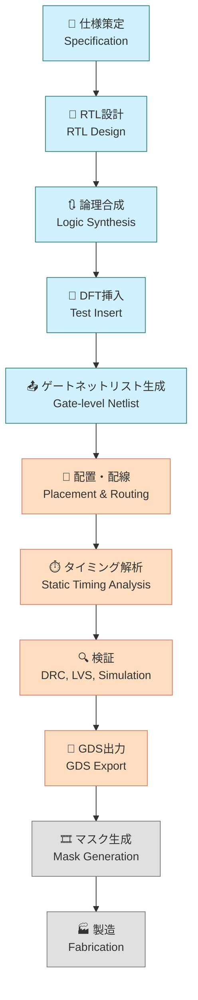

---

# 🏗️ 実践編 第3章：OpenLaneによるデジタル設計実習  
**Practical Chapter 3: Digital Design Practice Using OpenLane**

---

## 🔗 公式リンク / *Official Links*

| 言語 / Language | GitHub Pages 🌐 | GitHub 💻 |
|-----------------|----------------|-----------|
| 🇯🇵 日本語 / *Japanese* | [](https://samizo-aitl.github.io/Edusemi-v4x/e_chapter3_openlane_practice/) | [](https://github.com/Samizo-AITL/Edusemi-v4x/tree/main/e_chapter3_openlane_practice) |

---

## 📘 概要｜Overview

本章では、オープンソースEDAツール「**OpenLane**」を用いて、  
**Verilog RTL から GDS 生成までのデジタルLSI設計フロー**を実践形式で体験します。  

This chapter provides hands-on experience with a **digital implementation flow**  
from Verilog RTL to GDS layout using the open-source EDA framework **OpenLane**.

Sky130 PDKとの統合、制約ファイル、合成・配置・配線・DRCなど、  
**実用的な設計フロー全体**を体験的に学びます。

---

## 🎯 学習目標｜Learning Objectives

- ✅ RTL〜GDSまでの流れを把握し、実行できる  
  Understand and execute the RTL-to-GDS design flow  
- ✅ 各ステージ（合成・配置・配線・DRC等）の目的とツールを理解  
  Understand the role of each stage (synthesis, placement, routing, DRC, etc.)  
- ✅ 面積・タイミング・電力などのレポートを解釈し、設計へ反映できる  
  Interpret area, timing, and power reports and reflect insights into design  
- ✅ `SDC`, `floorplan`, `PDN` などの制約記述に習熟する  
  Gain proficiency in design constraints such as `SDC`, `floorplan`, and `PDN`

---

## 📚 フォルダ構成｜Folder Structure

| 📁 フォルダ | 📄 内容 / Description |
|------------|---------------------------|
| [`01_intro_openlane/`](01_intro_openlane/README.md) | OpenLaneとSky130の概要｜Overview of OpenLane & Sky130 |
| [`02_rtl_to_gds_flow/`](02_rtl_to_gds_flow/README.md) | RTLからGDSへの設計フロー｜RTL-to-GDS Implementation |
| [`03_power_timing_report/`](03_power_timing_report/README.md) | レポート出力と解析｜Power, Timing, Area Analysis |
| [`04_custom_constraint/`](04_custom_constraint/README.md) | 制約ファイルのカスタマイズ｜Constraint Customization |

---

## 🛠️ 使用ツール｜Required Tools

| 🧩 ツール | 🔍 説明 |
|----------|---------------------------|
| **OpenLane v2.x+** | メインEDAフロー（デジタル実装） |
| **Sky130 PDK (`sky130A`)** | 対応プロセス設計キット |
| **Docker** | 推奨実行環境（OpenLaneはDockerベース） |
| **Python 3.x** | レポート解析・自動化スクリプト用 |

---

## 📦 OpenLane / Sky130 の準備｜Setup Guide

以下の手順でOpenLaneおよびPDKを取得できます：

```bash
git clone https://github.com/The-OpenROAD-Project/OpenLane.git
cd OpenLane
make pull-openlane
make pull-sky130-pdk
```

🔎 詳細手順は → [`01_intro_openlane/`](01_intro_openlane/README.md)

---

## 🗺️ SoC設計の全体フロー｜SoC Design Flow Overview (Mermaid Diagram)

 [📎 GitHubでMermaidフローチャートを見る](https://github.com/Samizo-AITL/Edusemi-v4x/blob/main/e_chapter3_openlane_practice/README.md)



---

## 🔗 関連章｜Related Chapters

- [📁 第1章：Pythonによる自動化ツール群](../e_chapter1_python_automation_tools/README.md)  
- [📁 第2章：Sky130実験とSPICE特性評価](../e_chapter2_sky130_experiments/README.md)

---

## 📝 備考｜Notes

- ✅ 本章では Sky130 PDK に対応した最小構成の回路を使用します  
- 🔁 応用設計として SoC、IPマクロ、タイミング最適化などに拡張可能  
- 📤 GDSファイルの出力を通じて**MPW発注や後工程設計**にもつながる学習が可能です

---

## 👤 **著者・ライセンス | Author & License**

| 📌 項目 / Item | 📄 内容 / Details |
|------|------|
| **著者 / Author** | **三溝 真一**（Shinichi Samizo） |
| **💻 GitHub** | [](https://github.com/Samizo-AITL) |
| **📜 ライセンス / License** | [](https://samizo-aitl.github.io/Edusemi-v4x/#-ライセンス--license)<br>コード / Code: [MIT](https://opensource.org/licenses/MIT)<br>教材テキスト / Text: [CC BY 4.0](https://creativecommons.org/licenses/by/4.0/)<br>図表 / Figures: [CC BY-NC 4.0](https://creativecommons.org/licenses/by-nc/4.0/) |

---

## 🔙 戻る｜Back to Top

🏠 [](../) [](https://github.com/Samizo-AITL/Edusemi-v4x)
